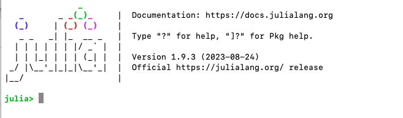
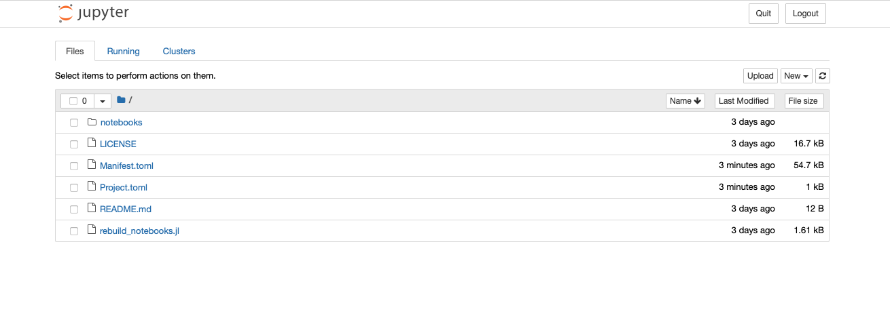
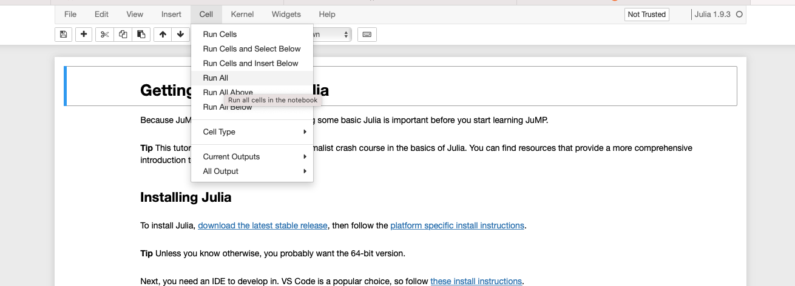

# SESO2023

This repository contains materials for two workshops:

 * [Julia and Optimization days 2023](https://julia-users-paris.github.io/workshop/en/index.html),
   to be held Wednesday 4 October, 2023
 * [SESO2023](https://cermics-lab.enpc.fr/seso2023/), to be held Tuesday 10
   October, 2023

Both workshops will be interactive. To follow along, you should download these
materials and install Julia prior to the workshop.

## Getting help

If you have trouble following the instructions below, please
[open a Github issue](https://github.com/odow/SESO2023/issues/new), or email
`o.dowson@gmail.com`.

## Install Julia

To get started, you first need to install Julia.

 - Download and install the **Current stable release** version of Julia from
   [https://julialang.org/downloads/](https://julialang.org/downloads/).

### Common problems

 - If you use Windows, choose the 64-bit installer
 - If you have a new M1 or M2 mac, choose the `(Apple Silicon)` version

### Alternatives

If you are comfortable using a command line, you may instead want to install
[juliaup](https://github.com/JuliaLang/juliaup), which is a small CLI for
managing and updating your installations of Julia.

## Download these materials

Next, you need to download a copy of these materials.

**If you have `git` installed**

`cd` to an appropriate directory, then run
```
git clone https://github.com/odow/SESO2023
```

**If you don't have `git` installed**

[Download this zip file](https://github.com/odow/SESO2023/archive/main.zip).
Once downloaded, unzip it to an appropriate location.

## Open Julia

Now open Julia, either by typing `julia` at a terminal, or by launching the icon
from wherever you installed it.

Once open, you should be faced with the Julia *REPL* that looks like this:



## Install the required packages

Now we need to install some packages.

In the Julia REPL, run the following commands, replacing the path with the
location of where you downloaded the materials.

```julia
cd("/Users/Oscar/Downloads/SESO2023-main")
import Pkg
Pkg.activate(".")
Pkg.instantiate()
Pkg.build("IJulia")
```

```julia
julia> cd("/Users/Oscar/Downloads/SESO2023-main")

julia> import Pkg

julia> Pkg.activate(".")
  Activating project at `~/Downloads/SESO2023-main`

julia> Pkg.instantiate()
    Updating registry at `~/.julia/registries/General`
    Updating git-repo `https://github.com/JuliaRegistries/General.git`
    Updating `~/Downloads/SESO2023-main/Project.toml`
... lots of lines omitted ...
Precompiling project...
  233 dependencies successfully precompiled in 274 seconds

julia> Pkg.build("IJulia")
    Building Conda ─→ `~/.julia/scratchspaces/44cfe95a-1eb2-52ea-b672-e2afdf69b78f/8c86e48c0db1564a1d49548d3515ced5d604c408/build.log`
    Building IJulia → `~/.julia/scratchspaces/44cfe95a-1eb2-52ea-b672-e2afdf69b78f/47ac8cc196b81001a711f4b2c12c97372338f00c/build.log`
```

**WARNING: it takes a few minutes to download and compile all the packages!**
**The good news is that you only have to run this command once.**

### Common problems

 - On Mac and Linux, `cd("~")` may throw an error instead of `cd`ing to your
   home directory:
   ```julia
   julia> cd("~")
   ERROR: IOError: cd("~"): no such file or directory (ENOENT)
   ```
   To fix, type the full path to the home directory, or type `cd("~`, then press
   the `TAB` key.

## Open a Jupyter notebook

Okay, last step, let's launch a Jupyter notebook. Open a Julia REPL and then
run:
```julia
import Pkg
cd("/Users/Oscar/Downloads/SESO2023-main")
Pkg.activate(".")
import IJulia
IJulia.notebook(dir = ".")
```

If all goes well, a browser window will open that looks like this:



To get started on the content portion of the tutorials, double click on the
"notebooks" folder, and then `00_getting_started_with_julia.ipynb`. Then click
"Cell > "Run All".



If things are sucessful, all of the cells should run (some will error on
purpose). You're now ready to follow along with the live training.

### Common problems

 - Don't start Jupyter via Anaconda! There are some version differences that
   cause problems.

## Updating the materials

I will continue to update these materials over time. To update the materials you
previous installed:

**If you have `git` installed**

`git pull` the latest changes. All of the packages will remain installed, so the
only thing that will change are the Jupyter notebooks.

### Common problems

 - If you made changes to a notebook that was updated, `git` will throw an error
   saying `error: Your local changes to the following files would be overwritten by merge:`
   If the changes can be discarded, do `git checkout notebook_name.ipynb` and
   then try `git pull` again.

**If you don't have `git` installed**

Download a new copy of the zip file, and then copy-paste the new notebooks into
the old directory. There is no need to re-run the other installation steps.
